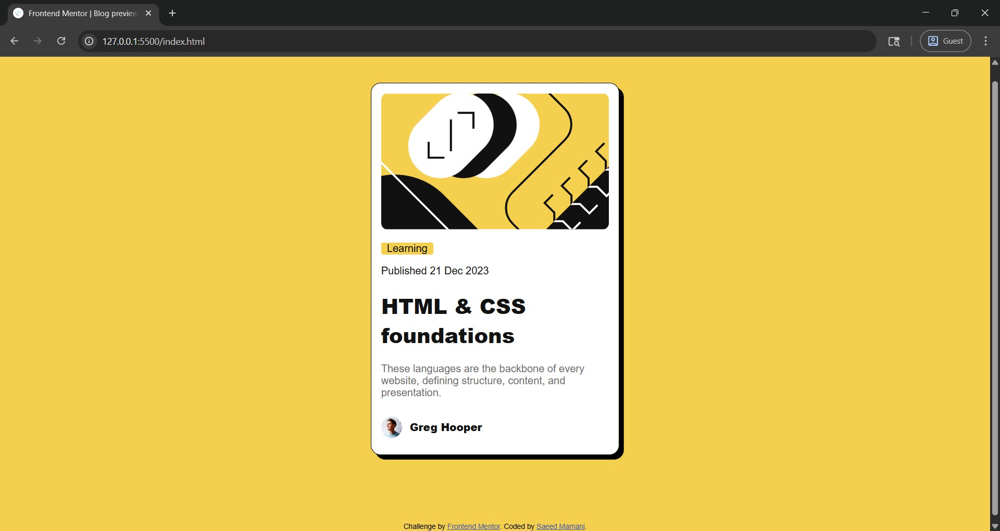

# Frontend Mentor - Blog preview card solution

This is a solution to the [Blog preview card challenge on Frontend Mentor](https://www.frontendmentor.io/challenges/blog-preview-card-ckPaj01IcS). Frontend Mentor challenges help you improve your coding skills by building realistic projects.

## Table of contents

- [Overview](#overview)
  - [The challenge](#the-challenge)
  - [Screenshot](#screenshot)
  - [Links](#links)
- [My process](#my-process)
  - [Built with](#built-with)
  - [What I learned](#what-i-learned)
  - [Continued development](#continued-development)
- [Author](#author)

## Overview

### The challenge

Users should be able to:

- See hover and focus states for all interactive elements on the page

### Screenshot



### Links

- Solution URL: [See my solution here](https://www.frontendmentor.io/solutions/blog-preview-card-using-html-and-css-iP_qJRw21S)
- Live Site URL: [See live site here](https://section33-ops.github.io/blog-preview-card/)

## My process

### Built with

- Semantic HTML5 markup
- CSS Grid
- CSS Flex
- Mobile-first workflow

### What I learned

I learnt how to add hover effect to elements

```css
.title:hover {
  color: hsl(47, 88%, 63%);
  cursor: pointer;
}
```

### Continued development

I would like to use more of CSS flex and flexbox in the future

## Author

- Portfolio Website - [Saeed Mamani](https://section33-ops.github.io/my-portfolio/)
- Frontend Mentor - [@Section33-ops](https://www.frontendmentor.io/profile/Section33-ops)
